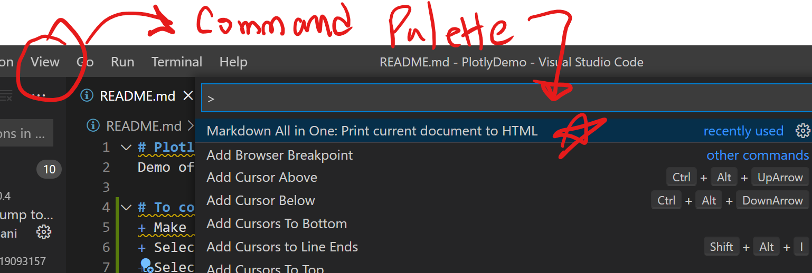

# PlotlyDemo
Demo of Plotly functionality - Contours, LineCharts, HeatMaps

## To convert this readme to HTML make sure of the following
+ Make sure that "Mardown All in One" - yzhang.markdown-all-in-one  is installed
+ Select your .md file 
+ Select VSCODE menu View | Command Pallette
+ Select the command Markdown All in One - Print current document to html

> note
> jnjn

```c
class x{
    x: 3.9;
}

```

> Tip - to create html page from your md file, select menu option View | Command palette, then run Markdown all in one Print to html

